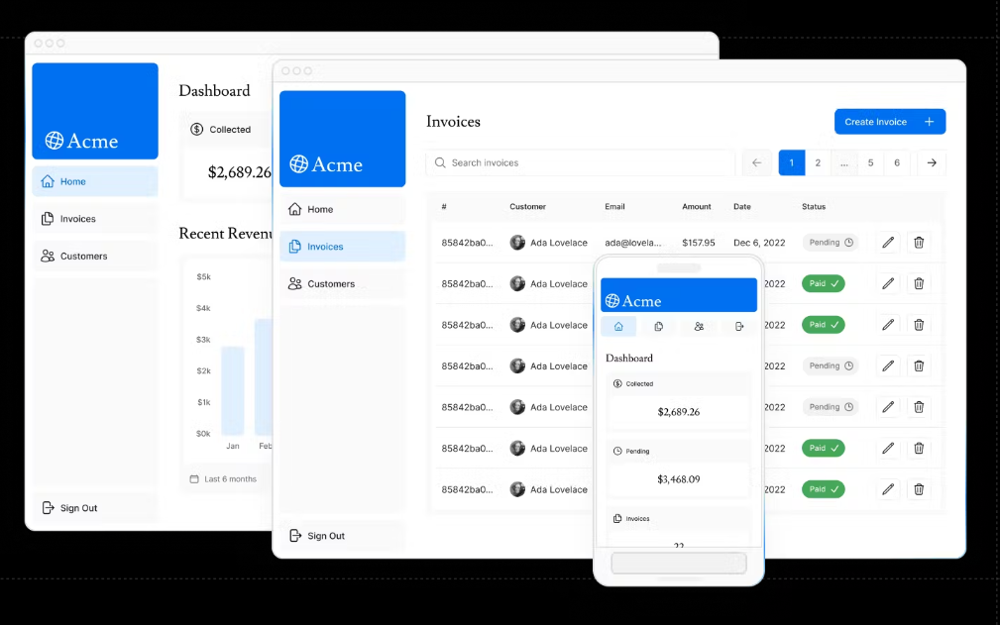
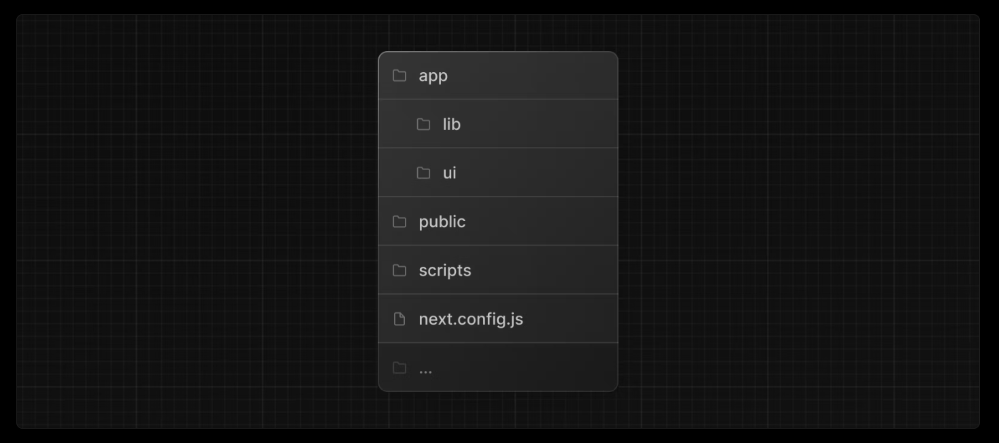

# Learn Next.js

[Next.js 공식 학습 문서 참고](https://nextjs.org/learn?utm_source=next-site&utm_medium=navbar&utm_campaign=learn_dashboard-app_getting-started)

 

 

## Introduction

- 프리 코스를 통해, 풀 스택 어플리케이션을 생성해보며, Next.js의 핵심 기능에 대해 배우는 것이 목표
- 금융 대시보드 기능
	- 홈페이지
	- 로그인 페이지
	- authentication으로 대시보드 페이지 보호 (인증 된 사용자만 접속 가능하게끔)
	- 유저가 청구서 추가, 수정, 삭제 할 수 있는 기능

 

## Overview
- **Style** : Next.js로 만든 웹 어플리케이션에서 어떤 다른 방식으로 스타일링을 하는지
- **Optimizations** : Image, Links, fonts를 어떻게 최적화 하는지
- **Routing** : file-system routing을 사용해서 중첩된 레이아웃과 페이지들을 어떻게 생성할 수 있는지
- **Data Fetching** : Vercel에 어떻게 데이터베이스를 셋업하는지, fetching과 streaming에 대한 학습
- **Search and Pagination** : URL Search Parmas를 사용해서 검색과 페이지네이션을 구현하는 방법
- **Mutating Data** : React Server Action을 사용하여 데이터를 변이시키고 Next.js 캐시를 재검증하는 방법
- **Error Handling** : 일반적인 에러와 404 not found 에러 처리법
- **Form Validation and Accessibility** : Server-side 폼 유효성 검사 하는 법과 접근성을 향상시키기 위한 팁
- **Authentication** : `NextAuth.js`와 미들웨어를 사용한 인증 방식 추가
- **Metadata** : 메타 데이타를 추가하는 방법과 어플리케이션을 소셜 공유하기 위한 준비

 

## Project Folder Structure

- `/app` : 애플리케이션의 모든 routes, components, logic을 포함하고 있는 폴더, 주로 이 곳 안에서 모두 작업을 완료함
- `/app/lib` : 애플리케이션에 쓰이는 모든 재사용 가능한 유틸리티 함수, 데이터 가져오기 함수(Data Fetching Func.)를 포함하는 폴더
- `/app/ui` : 애플리케이션에 사용되는 모든 UI 컴포넌트 포함 (ex. cards, tables, forms, etc.) 
- `/public` : 애플리케이션에 쓰이는 모든 정적 assets을 포함 (ex. Image File)
- `/scripts` : 데이터 베이스에 들어갈 테이블에 대한 입력 스크립트가 포함되어 있음

